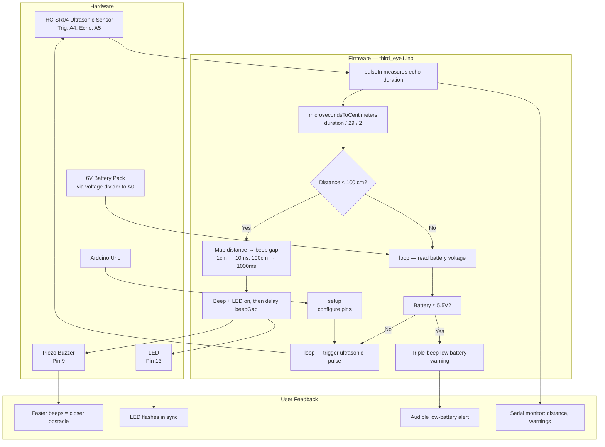

# Assistive Stick for the Visually Impaired

An Arduino-based walking stick that detects obstacles using an ultrasonic
sensor and beeps to warn the user. The closer the obstacle, the faster the
beeps.

Built in Grade 9 as a school team project. I was Head of Technical, which
meant I wrote the firmware and coordinated the hardware build.

## Background

The idea came from our school's assistive technology unit. The team wanted
to build something that would actually help someone, not just another
sensor demo. We settled on a walking stick because it's a familiar object
that people already use, so adding sensors to it doesn't require them to
learn a new tool.

We were a team of five. Roles broke down roughly as: two people on the
physical build (attaching the sensor to the stick, mounting the battery
pack, cable management), one person on documentation and presentation,
one person on the poster and demo setup, and me on firmware and electronics
wiring.

## Architecture

## How it works

The HC-SR04 ultrasonic sensor works by sending out a sound pulse and timing
how long it takes to bounce back. That gives us a distance reading.

The firmware logic:

1. Read distance from the sensor
2. If something is within 100 cm, start beeping
3. The beep gap scales with distance — 10 ms at 1 cm away, 1000 ms at 100 cm
4. Also light up an LED at the same time (visual feedback for people with
   partial vision)
5. Read battery voltage from an analog pin and warn if it drops below 5.5V

The scaling part is what makes it useful. A constant beep when something
is close would just be annoying — the user would probably turn it off. But
a beep that gets faster as they approach an obstacle gives them a continuous
sense of how close they are. Like the parking sensor on a car.

## Components

| Component | Purpose |
|-----------|---------|
| Arduino Uno | Microcontroller |
| HC-SR04 | Ultrasonic distance sensor |
| Piezo buzzer | Audio feedback |
| LED | Visual feedback |
| 6V battery pack | Power |
| Resistors | Voltage divider for battery monitoring |

## Code

`third_eye1.ino` — the firmware. Uses `pulseIn()` to time the echo pulse,
maps distance to beep frequency, and monitors battery voltage through a
voltage divider on analog pin A0.

A few things I'd clean up now that I've looked at it again:
- The `Serial.print(cm)` line is written twice (typo)
- The battery warning only prints to serial, doesn't beep
- All the tuning constants are hardcoded instead of being named variables

## Note on the prototype

The physical prototype was built and demonstrated at the school science fair
in Grade 9. It's stored at the school, which I no longer attend. The image
above is a TinkerCAD wiring simulation of the same circuit.

If I were building it again today, I'd want a real photo in this README.
Lesson learned: document the physical build while you still have it.

## What I'd improve

- **Replace the buzzer with a vibration motor.** Beeping in public is
  annoying and draws unwanted attention to the user. Vibration is silent
  and more discreet.
- **Add a side-facing sensor.** Right now it only detects obstacles straight
  ahead, which means the user can still bump into things at shoulder height
  or to the side.
- **Better battery monitoring.** The analog voltage divider works but it's
  imprecise. A proper fuel gauge IC would give accurate readings.
- **Enclose the electronics.** Right now everything is exposed on a breadboard.
  A 3D-printed case would make it actually usable outdoors.

## What I learned

The biggest lesson was that **the firmware is the easy part**. Any tutorial
will show you how to read an ultrasonic sensor. The hard part is the design
question underneath: how do you communicate distance to someone who can't
see it, without overwhelming them?

The first version we tried just beeped constantly when anything was close.
It was unbearable. The distance-scaled version was much better, but it took
us a couple of iterations to get the timing right.

Also learned that working in a team of five on hardware is harder than
working alone on software. You can't just merge branches — you have to
physically pass the prototype around and coordinate who has it when.

## Files

- `third_eye1.ino` — Arduino firmware
- `wiring-diagram.png` — TinkerCAD circuit diagram

## Running it

Open `third_eye1.ino` in the Arduino IDE, connect an Arduino Uno, and upload.
The wiring diagram shows how to connect the HC-SR04, buzzer, LED, and battery.
