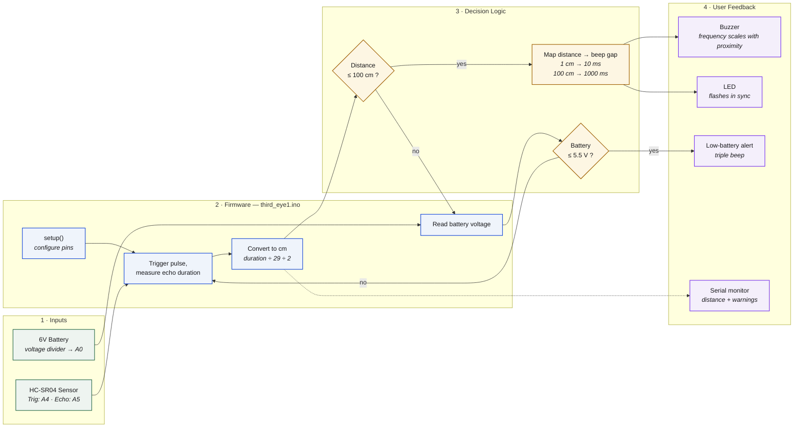

# Assistive Stick for the Visually Impaired

An Arduino-based walking stick that detects obstacles using an ultrasonic
sensor and beeps to warn the user. The closer the obstacle, the faster the
beeps.

Built in Grade 9 as a school team project. I was Head of Technical, which
meant I wrote the firmware and coordinated the hardware build.


## Background

The idea came from our school's assistive technology unit. The team wanted
to build something that would actually help someone, not just another
sensor demo. We settled on a walking stick because it's a familiar object
that people already use, so adding sensors to it doesn't require them to
learn a new tool.

We were a team of five. Roles broke down roughly as: two people on the
physical build (attaching the sensor to the stick, mounting the battery
pack, cable management), one person on documentation and presentation,
one person on the poster and demo setup, and me on firmware and electronics
wiring.

## Architecture



## How it works

The HC-SR04 ultrasonic sensor measures distance by timing how long a sound
pulse takes to bounce back. The firmware:

1. Reads distance from the sensor
2. If something is within 100 cm, beeps and flashes the LED
3. The beep gap scales with distance — 10 ms when close, 1000 ms when far
4. Reads battery voltage from analog pin A0 and prints a warning to the
   serial monitor if it drops below 5.5V

The distance-scaled beep is the important part. A constant beep when
something is close is annoying — the user would turn it off. A beep that
gets faster as they approach an obstacle gives continuous proximity feedback.

## Known issues in the current firmware

- The battery warning only prints to serial — it doesn't beep. A real user
  wouldn't see it.
- The ultrasonic reading isn't wrapped in a timeout, so a broken sensor
  can stall the loop.
- Tuning constants (100 cm, 5.5V, beep timing) are hardcoded.

## Components

| Component | Purpose |
|-----------|---------|
| Arduino Uno | Microcontroller |
| HC-SR04 | Ultrasonic distance sensor |
| Piezo buzzer | Audio feedback |
| LED | Visual feedback |
| 6V battery pack | Power |
| Resistors | Voltage divider for battery monitoring |

## Code

`third_eye1.ino` — the firmware. Uses `pulseIn()` to time the echo pulse,
maps distance to beep frequency, and monitors battery voltage through a
voltage divider on analog pin A0.

A few things I'd clean up now that I've looked at it again:
- The `Serial.print(cm)` line is written twice (typo)
- The battery warning only prints to serial, doesn't beep
- All the tuning constants are hardcoded instead of being named variables

## Tooling

`serial_logger.py` — records the Arduino's serial output to a CSV file
for offline analysis. Useful for testing sensor range and calibrating the
beep gap thresholds.

```bash
pip install -r requirements.txt
python serial_logger.py --port COM3 --duration 60
```

## Project history

**Grade 9 (original):** Firmware (`third_eye1.ino`), circuit, and
physical prototype. Built with a team of 5; I wrote the firmware and
coordinated the hardware build.

**2026 (added later):** I added `serial_logger.py` to record sensor
readings over serial for calibration, cleaned up the firmware (named
constants, sensor timeout, audible low-battery alert), and documented
the project properly in this README.

## What I'd improve

- **Replace the buzzer with a vibration motor.** Beeping in public is
  annoying and draws unwanted attention to the user. Vibration is silent
  and more discreet.
- **Add a side-facing sensor.** Right now it only detects obstacles straight
  ahead, which means the user can still bump into things at shoulder height
  or to the side.
- **Better battery monitoring.** The analog voltage divider works but it's
  imprecise. A proper fuel gauge IC would give accurate readings.
- **Enclose the electronics.** Right now everything is exposed on a breadboard.
  A 3D-printed case would make it actually usable outdoors.

## What I learned

The biggest lesson was that **the firmware is the easy part**. Any tutorial
will show you how to read an ultrasonic sensor. The hard part is the design
question underneath: how do you communicate distance to someone who can't
see it, without overwhelming them?

The first version we tried just beeped constantly when anything was close.
It was unbearable. The distance-scaled version was much better, but it took
us a couple of iterations to get the timing right.

Also learned that working in a team of five on hardware is harder than
working alone on software. You can't just merge branches — you have to
physically pass the prototype around and coordinate who has it when.

## Future work

- **Backend with Firebase Auth + Firestore.** Currently progress is
  stored in browser localStorage, so it doesn't sync across devices.
  Firebase would handle auth and storage without a custom server.
- **Spaced repetition.** Instead of just flagging weak topics, schedule
  reviews of missed questions at increasing intervals.
- **Question bank expansion.** The bank is currently Physics, Chemistry,
  and Maths. Adding more questions per topic would improve coverage.
- **Import/export.** Let users back up their progress to a file, since
  clearing browser data currently wipes everything.
  
## Files

- `third_eye1.ino` — Arduino firmware
- `wiring-diagram.png` — TinkerCAD circuit diagram

## Running it

Open `third_eye1.ino` in the Arduino IDE, connect an Arduino Uno, and upload.
The wiring diagram shows how to connect the HC-SR04, buzzer, LED, and battery.
